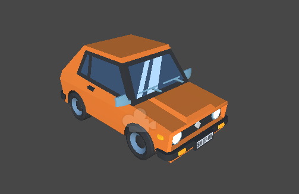

# AR-Cars-Menu

    

  <h3 align="center">AR Cars Menu</h3>

  

    A Simple App made with Unity and Vuforia.
     
  

## About The Project

  

    AR Cars Menu allows you to choose and change the size of 3 different car models while turning.
    For this it is necessary to point the camera at the target.
  

  

  
  

  
  

   
   
      

     
    
## Instructions
 

     Download <a href=https://mega.nz/file/ST5DTYTa#cPyUnNNA0uJI2hdk-UUmc7w_QL53Btm6FbXcerc8heI>Vuforia package</a>,
    add vuforia package to Packages.

    Open Project in Unity, Select Assets/Scenes/SampleScene.

